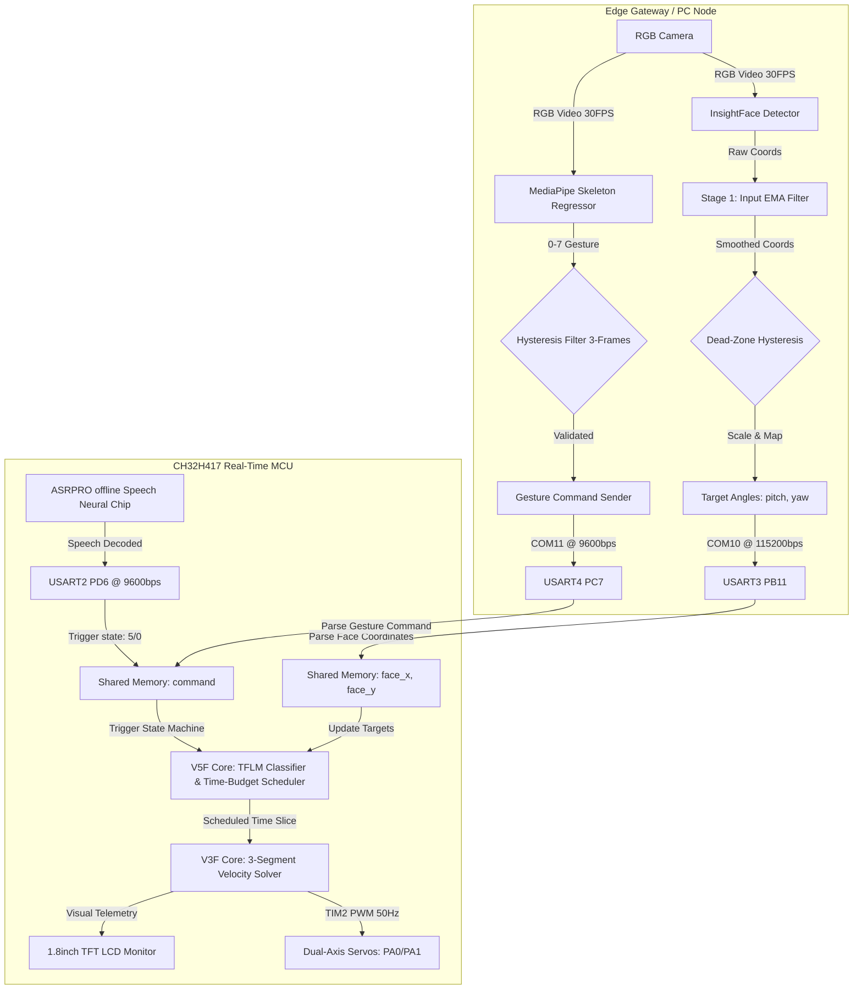

# CH32H417-EdgeGimbal

🚀 **A Distributed Heterogeneous Edge AI Gimbal Stabilization System Powered by CH32H417 and TFLM**

<p align="center">
  
  
  
  
  
</p>

`CH32H417-EdgeGimbal` is an advanced, offline-first **hierarchical heterogeneous Edge AI gimbal stabilizer**. Designed for high-speed, jitter-free motion tracking in robotics and smart terminals, it utilizes a divided computing topology where compute-intensive convolutional vision networks and offline speech processors work in tandem with a high-frequency **CH32H417 400MHz RISC-V MCU** running local machine learning decisions and real-time motion control.

🌐 *For Chinese users, please refer to [中文官方文档](./README.zh-CN.md).*

---

## 🌟 Key Features

* **🧠 On-Device TFLM Inference & Decision**  
  Deploys a lightweight classification and state-decision model built on the **TensorFlow Lite for Microcontrollers (TFLM)** framework directly onto the RISC-V V5F core, enabling offline multi-modal gesture and state command classifications.
* **⏳ Multi-Task Time-Budget Allocation**  
  Introduces a device-side time-budget scheduling algorithm. It enforces millisecond-level time-slice isolation between the non-deterministic TFLM inference tasks and hard real-time servo PWM tasks, ensuring zero timing jitter in the 50Hz (20ms) control loop.
* **🌀 Dual-Stage EMA Filter & Hysteresis Dead-Zone**  
  Implements a dual-stage Exponential Moving Average (EMA) filter ($\alpha_{in}=0.35, \alpha_{out}=0.30$) combined with a dual-axis independent hysteresis dead-zone (horizontal: 30px, vertical: 25px) to eliminate high-frequency pixel jitter from vision models and avoid motor hunting.
* **⚡ Three-Segment Error-Adaptive Servoing**  
  Replaces standard PID with a highly efficient, overshoot-free integer-only adaptive velocity convergence algorithm. It splits correction speeds dynamically: binary division ($error/2$) for large deviations, ternary deceleration ($error/3$) for medium ranges, and signum-step ($1^\circ$) for final settling.
* **📈 Constant-Velocity Motion Estimation**  
  Runs a temporal motion estimator on the MCU. If the target is static, it drops the vision detection frequency to **save 66% of edge compute power**, while using linear extrapolation to predict coordinates in between frames, maintaining 30FPS tracking smoothness.
* **🔄 Dual-Core Migration Ready**  
  Designed with a fully decoupled global shared memory structure (`gimbal_shared`) allowing atomic flag-based read/write operations, making it fully prepared to migrate tasks across the CH32H417's V5F and V3F cores.

---

## 📐 System Dataflow Topology



---

## 💻 Tech Stack & Core Algorithms

### 1. Dual-Stage Exponential Moving Average (EMA) Filter
To filter out pixel-level bounding box jitter without introducing noticeable phase lag, the system applies dual-stage recursive digital filters:

$$\text{Stage 1 (Coordinate): } \quad y_{in}[n] = \alpha_{in} \cdot x[n] + (1 - \alpha_{in}) \cdot y_{in}[n-1]$$
$$\text{Stage 2 (Angle): } \quad y_{out}[n] = \alpha_{out} \cdot \theta[n] + (1 - \alpha_{out}) \cdot y_{out}[n-1]$$

Where $\alpha_{in} = 0.35$ filters detection fluctuations, and $\alpha_{out} = 0.30$ shapes the physical servo trajectory to follow a natural, spring-damper-like decay curve.

### 2. Three-Segment Adaptive Velocity Solver (Integer-Only)
Instead of a continuous float-based PID, the MCU executes a discrete adaptive step solver every 10ms to achieve logarithmic convergence without overshoot:

```c
int error = target_angle[i] - current_angle[i];
int step;

if (abs(error) > 20)          // Segment 1: Large Error
    step = error / 2;         // Binary division for rapid catch-up
else if (abs(error) > 5)      // Segment 2: Medium Error
    step = error / 3;         // Ternary division for smooth approach
else                          // Segment 3: Micro Adjustment
    step = (error != 0) ? (error > 0 ? 1 : -1) : 0; // Signum step (1 degree)
```

| Steps | Current Angle | Error | Velocity Segment | Single Step size | Time Elapsed |
| :---: | :---: | :---: | :---: | :---: | :---: |
| **0** | $70^\circ$ | $100^\circ$ | Large Error | $+50^\circ$ | 0 ms |
| **1** | $120^\circ$ | $50^\circ$ | Large Error | $+25^\circ$ | 10 ms |
| **2** | $145^\circ$ | $25^\circ$ | Large Error | $+12^\circ$ | 20 ms |
| **3** | $157^\circ$ | $13^\circ$ | Medium Error| $+4^\circ$ | 30 ms |
| **4** | $161^\circ$ | $9^\circ$ | Medium Error| $+3^\circ$ | 40 ms |
| **6** | $166^\circ$ | $4^\circ$ | Micro-Adjust| $+1^\circ$ | 60 ms |
| **10**| $170^\circ$ | $0^\circ$ | Dead-Zone | $0^\circ$ | 100 ms |

---

## 🔌 Hardware Pinout & Wiring Specifications

> [!WARNING]
> High-torque servo motors generate peak currents up to 2.5A. **Never power the servos directly from the MCU development board.** Always use a separate 5V-6V external supply and connect its ground reference to the MCU's **GND** pin (Common Ground).

| Module | Peripheral | Pin | Connection Target | Baud Rate | Notes |
|:---|:---|:---|:---|:---:|:---|
| **Main Comm** | **USART8** | PE7 (RX)<br>PE8 (TX) | Host USB-to-UART (COM12) | 115200 bps | For MCU state reporting & handshake |
| **Face Coords**| **USART3** | PB11 (RX)<br>PB10 (TX)| Host USB-to-UART (COM10) | 115200 bps | Receives high-frequency camera mappings |
| **Gesture Cmd**| **USART4** | PC7 (RX)<br>PC6 (TX) | Host USB-to-UART (COM11) | 9600 bps | Receives hand gesture single-byte codes |
| **Speech Rx** | **USART2** | PD6 (RX)<br>PD5 (TX) | ASRPRO Voice TX1/RX1 | 9600 bps | Voice command receiving line |
| **Speech Tx** | **USART1** | PA10 (RX)<br>PA9 (TX) | ASRPRO Voice TX2/RX2 | 19200 bps | Voice prompt trigger feedback line |
| **Pitch Servo**| **TIM2_CH1**| PA0 | Pitch Servo Signal Line | 50Hz PWM | Physical limit clamped to 50° ~ 90° |
| **Yaw Servo**  | **TIM2_CH2**| PA1 | Yaw Servo Signal Line | 50Hz PWM | Physical limit clamped to 90° ~ 260° |
| **Monitor LCD**| **SPI/GPIO**| Standard | 1.8inch SPI TFT Screen | — | Real-time diagnostic monitor |

---

## 📂 Project Structure

```text
├── Common/                  # Core startup code and peripheral library (SPL)
│   ├── Common/              # gimbal_shared lock-free memory interface
│   └── Peripheral/          # CH32H417 Standard Peripheral Drivers
├── Python/                  # Edge Gateway Vision scripts
│   ├── config.py            # Limits, dead-zone, and filter parameters
│   └── 识别.py              # Main vision capture, detection, and tracking entry
├── V3F/                     # MCU V3F Core firmware project (Servo Driver)
│   └── User/                # Hard real-time control & 3-segment solver (servo.c)
├── V5F/                     # MCU V5F Core firmware project (Decision Center)
│   ├── App/                 # TensorFlow Lite Micro (TFLM) integration
│   └── User/                # Multi-modal state machine and routing (main.c)
├── CH32H417QEU.wvsln        # MounRiver Studio Solution file
├── merge_firmware.bat       # Dual-core firmware hex merger (Windows)
├── merge_firmware.sh        # Dual-core firmware hex merger (Linux/Bash)
└── 语音控制.hd              # Offline voice prompt/word definition source
```

---

## 🚀 Getting Started

### 1. Build and Flash Firmware
1. Install and launch **MounRiver Studio (MRS)**.
2. Import the solution file `CH32H417QEU.wvsln`.
3. Compile both `V3F` and `V5F` projects to output their respective `.hex` files.
4. Double-click `merge_firmware.bat` to merge the dual-core firmwares into a unified image and flash it via WCH-Link.

### 2. Setup Vision Gateway
Install Python 3.8+ dependencies:
```bash
pip install opencv-python numpy pyserial mediapipe insightface onnxruntime
```
*Note: The script automatically downloads ONNX model weights (`buffalo_l` or `Yunet`) on first run.*

Verify serial port COM mapping in Windows Device Manager, edit port configurations in `Python/识别.py`, then run:
```bash
python Python/识别.py
```

---

## 📊 Real-Time Telemetry & Self-Diagnosis

The TFT monitor's bottom line displays `F:xx G:xx V:xx`, designed for instant diagnostic verification without a logic analyzer:
* **`F:xx` (Face)**: USART3 coordinate frame counter. In tracking mode, this count should increment rapidly (30Hz). If static, check the host script or the PB11 connection.
* **`G:xx` (Gesture)**: USART4 gesture frame counter. Increments by 1 when a hand gesture change is verified. If static, check the PC7 connection.
* **`V:xx` (Voice)**: USART2 speech packet counter. Increments by 1 when an offline voice command is decoded. If static, check the PD6 wiring.

---

## 🔒 Security, Privacy & License

This project's default configurations represent structure templates only. Production deployment API credentials, database tokens, and private keys should be loaded via system environment variables, not hard-coded in the repository. Disclosed capture logs or video pipelines should use anonymized or synthetic data.

This project is licensed under the [MIT License](LICENSE).
