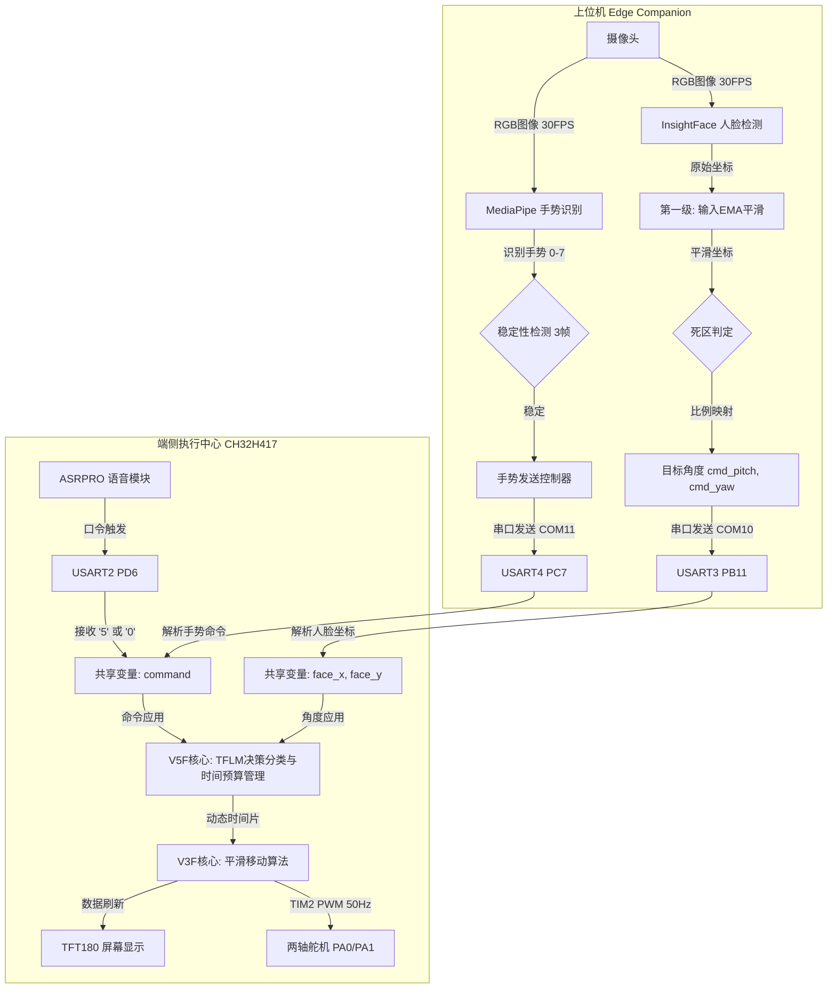

# CH32H417-EdgeGimbal

🚀 **基于 CH32H417 与 TFLM 框架开发的分布式异构协同边缘 AI 智能云台系统**

[](LICENSE)
[](http://www.wch.cn)
[](https://www.tensorflow.org/lite/microcontrollers)
[]()
[]()

`CH32H417-EdgeGimbal` 是一款面向物联网、机器人和智能终端的**分级异构边缘 AI 稳像云台系统**。该系统完全脱离云端，具备低延迟、高安全性及低功耗等端侧核心优势，支持人脸追踪、手势交互和离线语音命令的多模态联动控制。

---

## 🌟 核心亮点 (Key Features)

* **🧠 TFLM 端侧推理与时间预算调度**
  在 CH32H417 的 400MHz RISC-V 核心上基于 **TensorFlow Lite for Microcontrollers (TFLM)** 部署轻量化决策/分类模型。引入**端侧时间预算（Time Budget）算法**，实现硬实时控制任务与端侧 AI 推理任务的毫秒级时间片隔离，确保舵机伺服周期（20ms）的确定性。
* **📐 分级异构边缘协同计算**
  采用“边缘网关特征提取 + 嵌入式端侧决策”的异构拓扑。将高计算密集的 CNN 人脸检测（InsightFace）与 21 点手势骨架回归（MediaPipe）交给边缘网关（PC/嵌入式主机），将低功耗声学神经网络交给离线语音模块，而由 CH32H417 担任数据融合与高频动作执行中枢。
* **📈 自适应检测频率与状态估计**
  MCU 端运行等速运动前馈估计。当目标慢速运动或静止时动态延长检测间隔，**降低边缘视觉端 66% 的推理功耗**；在检测间隔帧进行轨迹线性外推，保证 30FPS 级别的连续伺服稳定性。
* **🌀 双级 EMA 滤波与迟滞死区机制**
  采用输入/输出双重指数移动平均（EMA）滤波，配合双轴独立迟滞死区（水平 30px，垂直 25px），完美滤除像素级视觉抖动，避免舵机高频“寻优”振荡，延长舵机齿轮寿命。
* **⚡ 三段式误差自适应速度算法**
  下位机采用高效的整数自适应速度决策：大误差二分赶超（$\text{step}=\text{error}/2$）、中误差三分靠拢、小误差符号函数微调落座，收敛速度极快且天然无过冲风险。

---

## 📐 系统数据流拓扑 (System Architecture)



---

## 🔌 硬件引脚分配与物理连线 (Pinout & Hardware Connection)

为防止大电流冲击导致 MCU 复位，**舵机供电必须与 MCU 隔离，并引出粗导线与 MCU 开发板共地（Common Ground）**。

| 模块名称 | 外设/通道 | 物理引脚 | 连接说明 | 默认波特率 | 备注 |
| :--- | :--- | :--- | :--- | :---: | :--- |
| **主通信串口** | **USART8** | **PE7 (RX)<br>PE8 (TX)** | 连电脑 USB-to-UART 模块 (COM12) | 115200 bps | 向上位机转发语音触发标志与握手状态 |
| **视觉坐标串口** | **USART3** | **PB11 (RX)<br>PB10 (TX)** | 连电脑 USB-to-UART 模块 (COM10) | 115200 bps | 接收上位机发来的高频人脸像素映射角度 |
| **手势指令串口** | **USART4** | **PC7 (RX)<br>PC6 (TX)** | 连电脑 USB-to-UART 模块 (COM11) | 9600 bps | 接收上位机 MediaPipe 识别出的手势单字节指令 |
| **语音指令通道** | **USART2** | **PD6 (RX)<br>PD5 (TX)** | 连 ASRPRO-01 语音模块的 TX1/RX1 | 9600 bps | 接收离线语音模块解码出的动作控制指令 |
| **语音播报通道** | **USART1** | **PA10 (RX)<br>PA9 (TX)** | 连 ASRPRO-01 语音模块的 TX2/RX2 | 19200 bps | 单片机向下发送语音播报控制字（如提示音） |
| **X轴伺服舵机** | **TIM2_CH1** | **PA0** | 连俯仰 (Pitch) 舵机信号线 | 50 Hz PWM | 角度范围限制在 50° ~ 90° 内，防止卡死 |
| **Y轴伺服舵机** | **TIM2_CH2** | **PA1** | 连偏航 (Yaw) 舵机信号线 | 50 Hz PWM | 角度范围限制在 90° ~ 260° 内 |
| **TFT液晶监视屏** | **SPI/GPIO** | **标准插针** | SPI 物理连接 1.8寸彩色 TFT | — | 状态诊断数据可视化输出 |

---

## 📂 项目结构 (Repository Structure)

```text
├── Common/              # 双核公共驱动、寄存器定义与异构数据共享层
│   ├── Common/          # gimbal_shared 共享结构体定义
│   └── Peripheral/      # CH32H417 官方外设驱动库 (SPL)
├── Python/              # 上位机边缘网关程序
│   ├── 识别.py          # 图像捕获、人脸检测、手势识别及坐标发送主入口
│   └── config.py        # 视觉端限幅、滤波系数与死区参数配置文件
├── V3F/                 # MCU V3F 核心工程文件夹（主频 240MHz/150MHz，负责实时控制）
│   ├── User/            # servo.c 伺服控制算法与硬件配置
│   └── CH32H417QEU_V3F.wvproj # MRS 编译工程
├── V5F/                 # MCU V5F 核心工程文件夹（主频 400MHz，负责TFLM与通信路由）
│   ├── App/             # TFLM 运行时模型加载与推理决策
│   └── User/            # 异构多模态状态机决策中心
├── CH32H417QEU.wvsln    # MounRiver Studio 解决方案快捷入口
├── merge_firmware.bat   # 双核 Hex 固件快速合并脚本 (Windows 环境)
├── merge_firmware.sh    # 双核 Hex 固件快速合并脚本 (Linux/Mac 环境)
└── 语音控制.hd          # ASRPRO 语音词条与口令板定义源文件
```

---

## 🚀 快速启动 (Quick Start)

### 1. 上位机环境部署
系统推荐使用 Python 3.8 ~ 3.10 运行环境。
```bash
# 安装核心依赖库
pip install opencv-python numpy pyserial mediapipe

# 安装边缘深度学习库（推荐配置 onnxruntime 以开启推理加速）
pip install insightface onnxruntime
```
*注：系统默认调用 Yunet 或 buffalo_l 模型，首次启动会自动下载所需模型参数。*

### 2. 运行视觉追踪
插好三个 USB-to-UART 串口模块，打开 Windows 设备管理器确认 COM 端口，修改 `Python/识别.py` 底部对应的端口号配置后启动：
```bash
python 识别.py
```

### 3. 下位机编译与烧录
1. 安装并打开 **MounRiver Studio (MRS)**。
2. 导入 `CH32H417QEU.wvsln` 解决方案。
3. 对 `V3F` 和 `V5F` 分别进行编译，生成对应的 `.hex` 固件。
4. 双击运行 `merge_firmware.bat`，脚本将自动读取编译好的固件并合并输出为一体化固件，使用 WCH-Link Utility 进行一次性烧录。

---

## 📊 性能表现与端侧运行指标 (Performance & Telemetry)

### 1. 算法收敛特性 (100°阶跃响应收敛测试)
通过三段式速度收敛算法，系统对阶跃输入的收敛过程如下表所示，全程**无任何物理过冲与回弹**：

| 迭代步数 | 实时误差 (error) | 速度决策区间 | 单步步进量 (step) | 收敛时间（每步 10ms） |
| :---: | :---: | :---: | :---: | :---: |
| **0** | $100^\circ$ | 大偏差区间 | $+50^\circ$ (二分收敛) | 0 ms |
| **1** | $50^\circ$ | 大偏差区间 | $+25^\circ$ (二分收敛) | 10 ms |
| **2** | $25^\circ$ | 大偏差区间 | $+12^\circ$ (二分收敛) | 20 ms |
| **3** | $13^\circ$ | 中偏差区间 | $+4^\circ$ (三分减速) | 30 ms |
| **4** | $9^\circ$ | 中偏差区间 | $+3^\circ$ (三分减速) | 40 ms |
| **6** | $4^\circ$ | 微调区间 | $+1^\circ$ (符号函数) | 60 ms |
| **10** | $0^\circ$ | 静态死区 | $0^\circ$ (静止并锁死) | 100 ms |

### 2. TFT 液晶屏监视器自诊断手册 (Telemetry Line 7)
TFT 彩色显示屏的最底行输出诊断字：`F:xx G:xx V:xx`，用于在无逻辑分析仪的情况下快速诊断通信链路故障：
* **`F:xx` (Face)**：表示 USART3 人脸坐标数据帧计数器。追踪开启时，该数字应当高速滚动（30Hz）。若静止，说明上位机坐标数据未成功下发，或 PB11 硬件线路虚接。
* **`G:xx` (Gesture)**：表示 USART4 手势指令帧计数器。当画面手势发生改变且被稳定捕捉时，该数字 `+1`。若不增加，检查 COM11 通道及 PC7 接线。
* **`V:xx` (Voice)**：表示 USART2 语音控制帧计数器。在发出语音口令后，该数字 `+1`。若说出命令后数字静止，检查语音模块供电或 PD6 连接。

---

## 🛠️ 避坑指南与二次开发备忘 (FAQ & Hard-won Lessons)

* **🔋 为什么舵机插上后单片机频繁死机？**
  * **原因**：舵机起转电流高达 1.5A ~ 2.5A，开发板 LDO 无法承载此脉冲，会导致 MCU 产生欠压复位（BOR）。
  * **解法**：必须将舵机正极（红线）连入外部独立的 5V-6V 2A 电源，且外部电源负极必须与开发板的 **GND** 连通以实现共地。
* **📶 为什么串口 USART7 配置完全正确，却收不到语音指令？**
  * **原因**：CH32H417QEU-R1 开发板原理图中，`PC12` 和 `PD2`（USART7）引脚路径上串联了 NC（空焊）电阻 R40/R42，引脚物理上处于断路状态。
  * **解法**：不改动硬件，避开此物理坑，将语音指令线重映射连接至畅通的 **`USART2` (PD5/PD6)**，程序中修改对应中断向量即可。
* **⏳ 为什么启动后单片机直接卡死不进入 main 循环？**
  * **原因**：`Sensor_Init()` 在初始化高频 ADC 时，WCH 官方库中的 Reset/Calibration 校准宏在特定供电波纹下存在极低概率的 `while` 环路死循环等待。
  * **解法**：默认代码中已对 `Sensor_Init` 进行屏蔽处理。二次开发使用传感器时，建议优化 ADC 校准逻辑，增加超时强行退出机制以防止整机挂起。

---

## 📄 开源协议 (License)

本项目采用 [MIT License](LICENSE) 开源协议。
