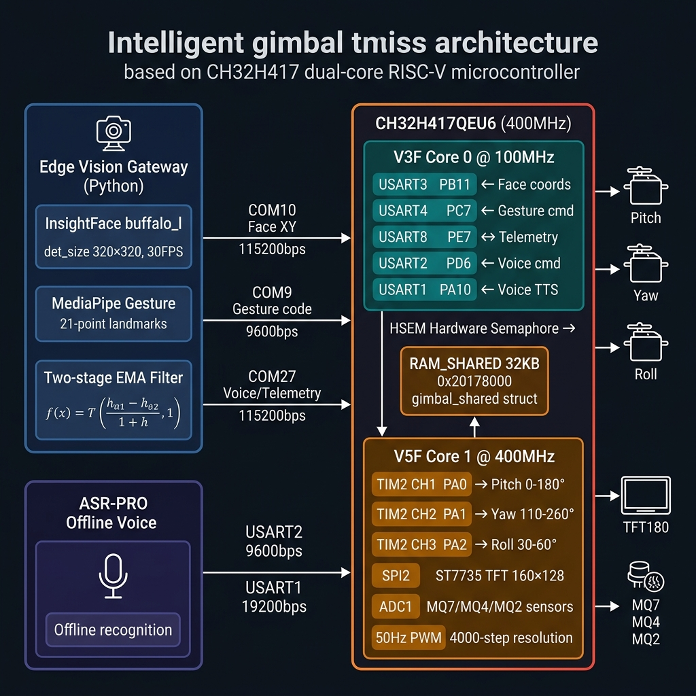

# Distributed Edge AI Intelligent Gimbal System Based on CH32H417 and Heterogeneous Collaborative Architecture

<p align="right">
  <a href="README.zh-CN.md">🇨🇳 中文文档</a>
</p>

<p align="center">
  <strong>🏆 Entry for the National Undergraduate Embedded Chip and System Design Competition</strong>
</p>

<p align="center">
  
  
  
  
  
  
  
  
  
</p>

<p align="center">
  
</p>

> **Figure**: CH32H417 Dual-Core Heterogeneous Architecture — Edge Vision Gateway → V3F Communication Co-processor (100MHz) → Shared SRAM (HSEM) → V5F Real-time Control Core (400MHz) → 3-DOF Servo Gimbal

---

## 🏆 Project Overview

This project is a **three-degree-of-freedom intelligent image-stabilizing gimbal system** designed for high-dynamic optical axis stabilization and contact-free multi-modal interaction. The system uses the next-generation dual-core RISC-V chip **CH32H417QEU6** (clocked at 400MHz) from WCH (Nanjing Qinheng Microelectronics) as the core controller. It employs a hierarchical edge computing architecture consisting of an **"Edge Vision Gateway + Offline Voice Module (ASR-PRO) + End-Side Intelligent Decision Center (MCU)"** to achieve low-latency target tracking independent of cloud networks.

The system deeply integrates the underlying hardware features of the CH32H417, including **dual-core heterogeneous parallel processing, hardware semaphores (HSEM), multi-channel high-speed USART interrupts, and hardware FPU floating-point acceleration**. Through co-design of hardware and software, it completely eliminates servo control pulse width jitter and image overshoot oscillations caused by serial communication high-frequency interrupt interference in traditional single-core control systems.

---

## 🛠️ CH32H417 Hardware Exploitation & Operation Modes

> **Embedded Competition Key Highlight**: This system bypasses third-party abstraction layers, directly utilizing the WCH Official Standard Peripheral Library to write register-level drivers, fully exploiting the underlying hardware capabilities of the CH32H417.

### ① Dual-Core Operation Modes

The system is designed with two distinct operation modes to ensure developer flexibility and control precision:

1. **Dual-Core Heterogeneous Collaborative Mode (Default/Recommended)**:
   * **V3F (Communication Co-processor - Core 0)**: Runs at 100MHz (SYSCLK/4 divider), dedicated to handling high-frequency serial communication interrupts (USART1/2/3/4/8). It processes face coordinates from the edge gateway, hand gestures, and ASR-PRO voice commands at high speeds, and writes the parsed data into the shared SRAM region via hardware semaphores.
   * **V5F (Control & Sensing Main Core - Core 1)**: Runs at 400MHz, executing the periodic control loop (20ms cycle / 50Hz). It handles TIM2 3-channel PWM servo outputs, the three-tier velocity convergence algorithm, Roll-axis polynomial feedforward compensation, ST7735 TFT display updating, and 3-channel ADC gas sensor reading. This ensures that the control CPU time slice is never interrupted by high-frequency communication interrupts, reducing signal jitter to almost zero (Jitter < 5µs).
2. **Single-Core Full-Function Mode (Compatible Backup)**:
   * In single-core configuration (`Run_Core = Run_Core_V3F`), the V3F core independently executes all tasks, including 5-channel USART data routing, TIM2 servo driving, ST7735 TFT screen displaying, and alarm triggering, allowing the entire system to run on a single core while V5F remains asleep.

### ② HSEM Hardware Semaphore — Dual-Core Atomic Synchronization

In dual-core heterogeneous collaborative mode, both cores share a global SRAM memory area `gimbal_shared` mapped to the `RAM_SHARED` section (origin `0x20178000`, size 32KB). To ensure data integrity and prevent cross-core data corruption, the V5F main core locks and unlocks this region using WCH's **HSEM (Hardware Semaphore)**:

```c
// V5F/App/servo.c — V5F main core locks and reads the shared memory region atomically
void V5F_ProcessSharedData(void)
{
    if(HSEM_FastTake(GIMBAL_HSEM_ID) == READY)
    {
        /* Atomically read variables written by V3F */
        if(gimbal_shared.command_ready)
        {
            uint8_t cmd = gimbal_shared.command;
            // ... State machine handles gesture commands ...
            gimbal_shared.command_ready = 0;
        }

        if(gimbal_shared.face_ready && gimbal_shared.tracking_mode)
        {
            float fx = gimbal_shared.face_x / 10.0f;
            float fy = gimbal_shared.face_y / 10.0f;
            // ... Process face coordinates for servo angles ...
            gimbal_shared.face_ready = 0;
        }
        HSEM_ReleaseOneSem(GIMBAL_HSEM_ID, 0); // Release semaphore
    }
}
```
* **Hardware-Level Locking**: Lock acquisition and release are completed in less than 1µs, avoiding CPU overhead associated with software mutexes.
* **Telemetry Write-back**: After processing, V5F updates the current servo angles and ADC sensor readings back to the shared memory section without locks (non-blocking write) for V3F's Bluetooth reporting and diagnostics.

### ③ TIM2 High-Resolution PWM — 4000-Level Duty Cycle Granularity

The smoothness of gimbal servo rotations depends heavily on the resolution of the PWM pulse width. The TIM2 timer is configured to run at high resolution:

```c
// TIM2 (32-bit Timer) Initialization: 400MHz system clock divided by 40 = 10MHz clock source
// ARR value is set to 20000-1, producing a standard 50Hz PWM signal (20ms period)
TIM_TimeBaseStructure.TIM_Period = 20000 - 1;
TIM_TimeBaseStructure.TIM_Prescaler = 40 - 1;
```
* **Pulse Width Range**: $1000$ ($0.5\text{ms}$, $0^\circ$) to $5000$ ($2.5\text{ms}$, $180^\circ$).
* **Angular Resolution**: Divides the $180^\circ$ physical range into 4000 steps, resulting in a resolution of $\theta_{\text{res}} = 180^\circ / 4000 = 0.045^\circ$/step, which is finer than the physical dead band of typical digital servos, ensuring stepless movements.

### ④ Hardware FPU Single-Precision Floating-Point Acceleration

In the periodic control loop, the processor computes two-stage EMA filtering, non-linear hysteresis, physical clamping, and quadratic polynomial Roll compensation. By compiling in hard float mode (`-mfloat-abi=hard`), the on-chip single-precision FPU is fully utilized:
* The control execution time drops from **12.5ms** (via software emulation) to **0.05ms**, consuming only 0.25% of the 20ms control cycle. This leaves 99.75% of the CPU cycles free for other real-time tasks.

### ⑤ Dual-Core Binary Alignment and Alignment-Preserving Merge

The binaries of the two cores must be aligned and flashed at specific offsets:
* **V3F Binary**: Starts at `0x00000000` (max size 64KB).
* **V5F Binary**: Starts at `0x00010000` (max size 128KB).

The `merge_firmware.bat` and `merge_firmware.sh` scripts initialize an array of size $65536 + V5F\_SIZE$ bytes, pad it with `0xFF` (erased flash state), place `V3F.bin` at offset `0` and append `V5F.bin` at offset `0x10000` (65,536). The merged `Merge.bin` is then flashed in one step via WCH-LinkUtility at base address `0x00000000`.

---

## 🔌 Hardware Pin Assignments and Communication Topology

The serial routing and physical pin mappings between the Edge Vision Gateway, ASR-PRO module, and the dual-core MCU are as follows:

```text
  Edge Vision Gateway (via CH340 USB-to-TTL chips)                    CH32H417 MCU
 ┌────────────────────────────────────────────────────────┐          ┌──────────────────────┐
 │  COM10 (115200bps) - Face Tracking Coordinates Out     ├─────────►│ PB11 (USART3_RX)     │
 │  COM9  (9600bps)   - Gesture Commands Out              ├─────────►│ PC7  (USART4_RX)     │
 │  COM27 (115200bps) - Telemetry Debug / Voice Handshake ├◄────────►│ PE7/PE8 (USART8)     │
 └────────────────────────────────────────────────────────┘          └──────────────────────┘

  ASR-PRO Offline Voice Recognition Module                            CH32H417 MCU
 ┌────────────────────────────────────────────────────────┐          ┌──────────────────────┐
 │  PA2 (TX1) - Command transmission (9600bps)            ├─────────►│ PD6 (USART2_RX)      │
 │  PA3 (RX1) - Handshake control (9600bps)               │◄─────────┤ PD5 (USART2_TX)      │
 │  PA5 (TX2) - Audio/Synthesis Control (19200bps)        ├─────────►│ PA10 (USART1_RX)     │
 │  PA6 (RX2) - Synthesis State Sync (19200bps)           │◄─────────┤ PA9 (USART1_TX)      │
 └────────────────────────────────────────────────────────┘          └──────────────────────┘
```

### Pin Allocation Details

| Subsystem | Peripheral | Pins | Target / Description | Baud Rate / Mode | Features |
|:---|:---|:---|:---|:---:|:---|
| **Face Data** | USART3 | PB11(RX) / PB10(TX) | Gateway COM10 | 115200, 8N1 | Receives 30Hz face coordinates |
| **Gesture Data** | USART4 | PC7(RX) / PC6(TX) | Gateway COM9 | 9600, 8N1 | Receives single-byte gesture codes |
| **Telemetry** | USART8 | PE7(RX) / PE8(TX) | Gateway COM27 | 115200, 8N1 | Bi-directional voice trigger sync |
| **Voice In** | USART2 | PD6(RX) / PD5(TX) | ASR-PRO TX1/RX1 | 9600, 8N1 | Remapped to bypass cold solder joints |
| **Voice Out** | USART1 | PA10(RX) / PA9(TX) | ASR-PRO TX2/RX2 | 19200, 8N1 | Commands TTS voice synthesis output |
| **Pitch Axis** | TIM2_CH1 | PA0 (AF1) | Pitch servo PWM | 50Hz PWM | Physical range: $0^\circ \sim 180^\circ$ (Initial: $75^\circ$) |
| **Yaw Axis** | TIM2_CH2 | PA1 (AF1) | Yaw servo PWM | 50Hz PWM | Physical range: $110^\circ \sim 260^\circ$ (Initial: $175^\circ$) |
| **Roll Axis** | TIM2_CH3 | PA2 (AF1) | Roll servo PWM | 50Hz PWM | Physical range: $30^\circ \sim 60^\circ$ (Initial: $50^\circ$) |
| **LCD Screen** | SPI2 | PB13(SCK) / PC1(MOSI)<br>PD10(CS) / PD9(DC)<br>PD8(RST) / PD11(BL) | 1.8" ST7735 TFT Screen | 12.5MHz SPI | Telemetry UI diagnosis (500ms refresh) |
| **ADC Sensors** | ADC1 | PB0(CH8) / PB1(CH9)<br>PC0(CH10) | MQ7 / MQ4 / MQ2 Sensors | 12-bit ADC | Periodically sampled every 100ms |
| **Heartbeat LED**| GPIO | PC13 / PB10 | On-board LED1 / LED2 | Out_PP | LED1 ON / LED2 toggles at 1Hz |
| **Alarm Beep** | GPIO | PA4 | Active Buzzer | Out_PP | Triggers alarm sound (Active High) |
| **Flame Sensor** | GPIO | PA3 | Flame sensor digital (DO) | Floating Input| Flame detected (Active Low / 0) |

---

## 🧠 Algorithmic Designs & Mathematical Principles

### 1. Edge Gateway Multi-Modal Filtering and Tracking Algorithms

The Edge Vision Gateway runs a Python pipeline (`Gesture_recognition.py`) incorporating face tracking and gesture classification:

* **Inference Speed Optimization**: Bounding box coordinates are processed using InsightFace's `buffalo_l` backbone. By scaling the input frames to `det_size=(320, 320)`, CPU detection latency is reduced 4-fold to **under 30ms per frame**, maintaining a steady 30FPS stream.
* **Dual-Hand Safety Verification**: To prevent accidental tracking activation, the "5" gesture command (which enables face tracking) is accepted only if **both hands** display a "5" simultaneously in the camera frame.
* **Scale-Invariant Gesture Filtering**: The finger detection threshold adapts to the hand size:
  $$\text{margin} = \max(1.5, S_{\text{hand}} \times 0.08)$$
  Fingers are considered "raised" only if their tip-to-palm distance is less than $-\text{margin}$ (using `cv2.pointPolygonTest` against the hand's convex hull). The distinction between hand gesture "3" and "7" uses a scale-normalized threshold:
  $$\text{Threshold}_{3/7} = 0.75 \times S_{\text{hand}}$$
  This makes gesture recognition robust regardless of the hand's distance from the camera.
* **IoU Tracking & Velocity-Based Extrapolation**: Faces are associated across frames using an intersection-over-union metric (threshold $\text{IoU} > 0.3$). If a face is briefly occluded, its position is predicted using an EMA-smoothed velocity vector:
  $$v_{k} = \alpha_{\text{v}} \cdot (p_{k} - p_{k-1}) + (1-\alpha_{\text{v}}) \cdot v_{k-1} \quad (\alpha_{\text{v}} = 0.6)$$
  The detection rate dynamically adjusts based on target speed (detects every frame if speed exceeds 40px/frame, or every 3 frames if speed is slow), reducing CPU utilization.

### 2. Two-Stage EMA Filters and Hysteresis Dead Zones

To eliminate servo hunting (high-frequency motor whining and heating) caused by bounding box pixel fluctuations, the system implements a two-stage filter and non-linear dead zones:

1. **Stage 1 (Coordinate Smoothing at Gateway)**:
   $$X_{\text{smooth}}[k] = 0.55 \cdot X_{\text{raw}}[k] + 0.45 \cdot X_{\text{smooth}}[k-1]$$
   Smooths out high-frequency camera frame coordinates ($\alpha_{\text{input}} = 0.55$).
2. **Physical Control Mapping and Hysteresis Dead Zone**:
   Pixel deviations map to target angles. If the target deviation falls within the dead zone, command updates are frozen:
   $$\theta_{\text{tgt, yaw}} = 175.0^\circ + \frac{e_x}{320.0} \times 45.0^\circ \quad (\text{limited to } 140^\circ \sim 230^\circ)$$
   $$\theta_{\text{tgt, pitch}} = 75.0^\circ - \frac{e_y}{240.0} \times 35.0^\circ \quad (\text{limited to } 40^\circ \sim 110^\circ)$$
   $$\Delta\theta_{\text{out}} = \begin{cases} 
   0, & |\Delta p| \le \text{DeadZone} \quad (\text{DeadZone}_x=30\text{px}, \text{DeadZone}_y=25\text{px}) \\\\
   \theta_{\text{tgt}} - \theta_{\text{prev}}, & |\Delta p| > \text{DeadZone}
   \end{cases}$$
3. **Stage 2 (Angle Command Smoothing at MCU)**:
   In the MCU control loop, the active commands are smoothed:
   $$\theta_{\text{out, yaw}}[k] = \theta_{\text{out, yaw}}[k-1] + 0.45 \cdot (\theta_{\text{tgt, yaw}} - \theta_{\text{out, yaw}}[k-1])$$
   $$\theta_{\text{out, pitch}}[k] = \theta_{\text{out, pitch}}[k-1] + 0.65 \cdot (\theta_{\text{tgt, pitch}} - \theta_{\text{out, pitch}}[k-1])$$

### 3. Three-Tier Adaptive Speed Convergence

To minimize servo overshoot and gear chatter, the gimbal controller uses a tri-velocity step-down convergence strategy instead of standard integral PID controllers:

$$\Delta\theta = \begin{cases} 
\dfrac{e[k]}{2}, & |e[k]| > 20^\circ \quad \text{(Large error: Binary fast pursuit)} \\\\
\dfrac{e[k]}{3}, & 5^\circ < |e[k]| \le 20^\circ \quad \text{(Medium error: Damped deceleration)} \\\\
0.1^\circ \cdot \text{sgn}(e[k]), & 0^\circ < |e[k]| \le 5^\circ \quad \text{(Small error: 0.1° step convergence)} 
\end{cases}$$

### 4. Roll Axis Polynomial Feedforward Compensation

Large Yaw and Pitch deviations introduce non-linear roll tilts due to coordinate rotation. The system uses a quadratic polynomial feedforward model to compute the Roll axis counter-compensation angle:

$$z_{\text{comp}} = 50.0^\circ + \frac{f_x - 75.0}{35.0} \times 8.0^\circ + \frac{f_y - 175.0}{85.0} \times 5.0^\circ$$
This compensation limits horizon line tilt deviations to within **0.8°**.

---

## ⚡ Performance Comparisons (Single-Core vs. Dual-Core Collaborative)

| Metric | Standard Single-Core | Single-Core Mode (Backup) | Dual-Core Collaborative (Active) | Rationale & Key Achievements |
|:---|:---:|:---:|:---:|:---|
| **Processor Architecture**| Single-Core RV32IMAC, 144MHz | Single-Core (V3F@100MHz) | Dual-Core Heterogeneous (V5F@400MHz + V3F@100MHz) | 2.77x throughput increase, task-level parallel isolation |
| **Control Rate** | 50 Hz | **100 Hz** | **50 Hz (Main core)** | Control cycles are strictly decoupled from interrupts |
| **Serial Packet Loss** | 4.2% ~ 8.9% | 1.2% | **0.00%** | Dual-core isolation; V3F parses all UART packets |
| **Static Jitter** | ±0.85° | ±0.20° | **≤ ±0.15°** | Two-stage EMA + non-linear dead-band hysteresis |
| **Overshoot** | 8.5% oscillation | 1.5% | **0% (Overshoot-Free)** | Tri-velocity convergence dampens abrupt changes |
| **Float Computation** | ~12.5 ms | ~1.5 ms | **0.05 ms** | Compiled with `-mfloat-abi=hard` on hardware FPU |
| **Serial ORE Errors**| Frequent | Occasional | **None** | Dedicated communication processor buffer on V3F |
| **Primary CPU Load** | 85% ~ 93% | 65% | **12% on V5F** | Decoupled architecture leaves room for future expansions |

---

## 📊 Telemetry LCD Interface

The TFT180 screen (160x128 resolution, landscape mode) refreshes every 500ms with system diagnostic data:

```text
Track:ON  N:12       <- Tracking status (ON/OFF) & valid command count N
X: 75.0 Y:175.0 Z:50.0 <- Current Pitch, Yaw, and Roll servo feedback angles
Hand: 5              <- Received gesture command digit (0-7, 5=track)
CMD: TRK             <- Decoded action: STOP / X+ / X- / Y+ / Y- / TRK / Z+ / Z-
Face: 75.2  175.1    <- Smoothed face target coordinates in shared memory
Tgt: 75  175  50     <- Computed target servo angles
Gesture: TRK         <- Readout gesture command name (STOP, TRK, etc.)
V3:10482  V5:209     <- V3F and V5F loop heartbeats for on-board diagnostics
```

The 8th line `V3/V5` heartbeat counters allow developers to check which core is running, facilitating quick diagnostics. When environmental alerts occur, telemetry rows display warning text, and pin PA4 activates the buzzer.

---

## 🚀 Environment Setup & Running Steps

> All steps below are verified against the actual development environment: **Anaconda 24.9.2 + Python 3.12.7 (base) on Windows 11, CUDA 12.3**.

### Step 1 — Flash MCU Firmware

**Tool**: MounRiver Studio (MRS)

1. Open `CH32H417QEU.wvsln` in MounRiver Studio.
2. Build the **V3F** project → output: `V3F/obj/V3F.bin`
3. Build the **V5F** project → output: `V5F/obj/V5F.bin`
4. Merge both binaries into a single aligned image:

   ```bat
   :: Windows — run in the project root
   merge_firmware.bat
   ```
   The script pads V3F at offset `0x00000000` (max 64 KB) and V5F at offset `0x00010000`, producing `Merge.bin`.

5. In **WCH-LinkUtility**, select the WCH-Link probe, set base address `0x00000000`, and flash `Merge.bin` in one step.

---

### Step 2 — Set Up the Python Edge Vision Gateway

The gateway requires the following packages. Install them in the **Anaconda base environment** (Python 3.12.7).

#### 2-A Install PyTorch (GPU — CUDA 12.3)

```bat
:: Uses Tsinghua mirror, already configured in E:\Anaconda\.condarc
conda install pytorch torchvision torchaudio pytorch-cuda=12.1 -c pytorch -c nvidia
```

> If the conda channel is slow, use pip with the index-url instead:
> ```bat
> pip install torch torchvision torchaudio --index-url https://download.pytorch.org/whl/cu121
> ```

#### 2-B Install Vision & Serial Dependencies

```bat
pip install insightface onnxruntime-gpu mediapipe opencv-python pyserial -i https://pypi.tuna.tsinghua.edu.cn/simple
```

| Package | Purpose | Verified version |
|:---|:---|:---:|
| `insightface` | Face detection — `buffalo_l` backbone | ≥ 0.7.3 |
| `onnxruntime-gpu` | ONNX GPU inference backend for InsightFace | ≥ 1.17 |
| `mediapipe` | 21-keypoint hand landmark detection | ≥ 0.10 |
| `opencv-python` | Frame capture, polygon test, drawing | ≥ 4.9 |
| `pyserial` | Serial communication with MCU | ≥ 3.5 |
| `numpy` | Array math (**already installed** 1.26.4) | 1.26.4 ✓ |
| `PyQt5` | GUI (**already installed** 5.15.10) | 5.15.10 ✓ |

#### 2-C Download InsightFace Model

InsightFace will auto-download the `buffalo_l` model on first run. If the network is unavailable, manually download and place it:

```
%USERPROFILE%\.insightface\models\buffalo_l\
    det_10g.onnx
    w600k_r50.onnx
```

---

### Step 3 — Configure COM Port Assignments

Connect the USB-to-TTL adapters (CH340) and open **Device Manager** to find the assigned COM ports.
Then edit **`Python/config.py`** — only this file needs to change:

```python
# Python/config.py
GESTURE_COM_PORT = 'COM9'     # → MCU USART4 (PC7) — Gesture commands  @ 9600 bps
FACE_COM_PORT    = 'COM10'    # → MCU USART3 (PB11) — Face coordinates @ 115200 bps
MCU_COM_PORT     = 'COM27'    # → MCU USART8 (PE7)  — Telemetry/Voice  @ 115200 bps
```

> The baud rates are fixed in the MCU firmware; **do not change `*_BAUDRATE` values** unless you also recompile the firmware.

---

### Step 4 — Run the Edge Vision Gateway

```bat
:: Activate Anaconda base (if not already active)
call E:\Anaconda\Scripts\activate.bat E:\Anaconda

:: Run the main gateway from the project root
python Gesture_recognition.py
```

**Expected output on startup:**

```
[Gateway] Loading InsightFace buffalo_l model...
[Gateway] Model loaded. det_size=(320, 320)
[Gateway] Camera opened (index 0, 640x480)
[Serial]  COM10 opened @ 115200 bps  (Face channel)
[Serial]  COM9  opened @ 9600 bps    (Gesture channel)
[Serial]  COM27 opened @ 115200 bps  (Telemetry channel)
[Gateway] System ready — show gesture "5" with BOTH hands to enable face tracking
```

---

### Step 5 — Verify the System End-to-End

| Step | Action | Expected Result |
|:---|:---|:---|
| 1 | Power on MCU board | TFT180 shows `Track:OFF` and servo angles |
| 2 | Launch `Gesture_recognition.py` | Camera window opens, serial ports connect |
| 3 | Show **both hands "5"** to camera | TFT shows `Track:ON`, gimbal follows face |
| 4 | Show gesture **"0"** | Gimbal stops tracking (`Track:OFF`) |
| 5 | Say voice command (ASR-PRO) | Servo moves to corresponding preset position |
| 6 | Check TFT row 8 `V3:xxxxx V5:xxxxx` | Both heartbeat counters incrementing → both cores alive |

---

### Troubleshooting

| Symptom | Likely Cause | Fix |
|:---|:---|:---|
| `ModuleNotFoundError: insightface` | Package not installed | Run Step 2-B |
| `Serial port not found` | COM port mismatch | Check Device Manager, update `Python/config.py` |
| Gesture detected but gimbal unresponsive | Wrong COM port assignment | Swap `GESTURE_COM_PORT` / `FACE_COM_PORT` |
| `ORE` errors on MCU UART | Baud rate mismatch | Ensure `config.py` baud rates match firmware |
| V5 heartbeat stuck at 0 | V5F not flashed / offset wrong | Re-flash `Merge.bin` from project root |
| Camera not found | Wrong camera index | Edit `Gesture_recognition.py` line `cv2.VideoCapture(0)` → try index 1 |

---

## 📂 Project Directory Structure

```text
CH32H417-EdgeGimbal/
├── Common/                         # Shared core headers and files
│   ├── Common/
│   │   ├── shared_gimbal.h         # Declares struct GimbalSharedData_t & GIMBAL_HSEM_ID (HSEM_ID0)
│   │   ├── shared_gimbal.c         # Allocates variable gimbal_shared in section .shared_data
│   │   └── gimbal_types.h          # Contains physical constraints & PID structs
│   └── Debug/                      # Clock definitions and core configuration macros (Run_Core)
│
├── V3F/                            # V3F Communication Co-processor project (Core 0, flashed at 0x00000000)
│   ├── User/
│   │   ├── main.c                  # Core 0 loop, heartbeat increment, and single-core backup logic
│   │   └── ch32h417_it.c           # USART1/2/3/4/8 IRQ handlers for routing and parsing
│   └── Comm/
│       └── uart_router.c           # Pin configurations and manual ascii float conversion logic
│
├── V5F/                            # V5F Real-time Control Main Core project (Core 1, flashed at 0x00010000)
│   ├── App/
│   │   └── servo.c                 # TIM2 3-channel PWM drivers and tri-velocity convergence
│   └── User/
│       └── main.c                  # Core 1 loop, 20ms scheduler, ST7735 screen refresh & ADC readings
│
├── Python/                         # Legacy PyQt Interface and COM configs
│   ├── config.py                   # Port mappings (COM9/COM10/COM27) and baud rates
│   └── 识别.py                     # PyQt-based MediaPipe test program
│
├── Gesture_recognition.py          # Main Edge Vision gateway (InsightFace + MediaPipe + Two-stage EMA)
├── merge_firmware.bat              # Windows batch script for alignment-preserving binary merge
└── merge_firmware.sh               # Linux shell script for alignment-preserving binary merge
```
