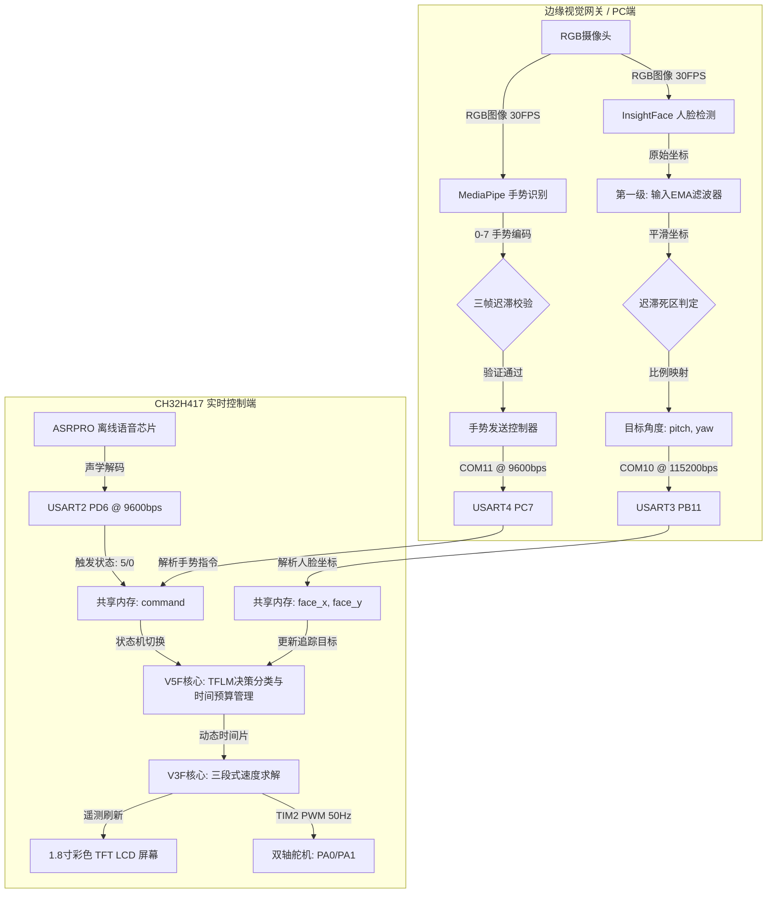

# CH32H417-EdgeGimbal

🚀 **基于 CH32H417 与 TFLM 框架开发的分布式异构协同边缘 AI 智能云台系统**

<p align="center">
  
  
  
  
  
</p>

`CH32H417-EdgeGimbal` 是一款先进的、离线运行的**分级异构边缘 AI 稳像云台系统**。专为机器人及智能终端中的高速无抖动目标追踪而设计，它采用分级计算拓扑，使计算密集的卷积视觉网络和离线语音处理器与主频 400MHz 的高频 **CH32H417 RISC-V MCU** 协同工作，并在下位机实现本地机器学习决策与实时运动控制。

🌐 *英文用户请参阅主页文档 [English Documentation](./README.md)。*

---

## 🌟 核心特性 (Key Features)

* **🧠 TFLM 端侧推理与状态决策**  
  基于 **TensorFlow Lite for Microcontrollers (TFLM)** 框架，在 RISC-V V5F 内核上直接部署轻量化分类与状态决策模型，实现手势及状态口令的片上本地化推理分类。
* **⏳ 多任务时间预算（Time-Budget）分配**  
  引入端侧时间预算调度算法。在非确定的 TFLM 推理任务与硬实时舵机控制任务之间实施毫秒级时间片隔离，确保 50Hz (20ms) 控制循环的零抖动确定性。
* **🌀 双级 EMA 滤波器与自适应迟滞死区**  
  设计输入/输出双重指数移动平均（EMA）滤波（$\alpha_{in}=0.35, \alpha_{out}=0.30$），配合双轴独立迟滞死区（水平 30px，垂直 25px），完美滤除视觉检测的像素级抖动并防止舵机高频振荡。
* **⚡ 三段式误差自适应速度算法**  
  采用高效的整型误差自适应步进算法取代繁琐的 PID。根据角度误差动态切换控制模式：大偏差二分追赶（$error/2$）、中偏差三分减速（$error/3$）、小偏差符号函数步进（$1^\circ$），实现无过冲的快速对准。
* **📈 恒速运动状态估计与自适应频率**  
  下位机运行运动状态前馈估计。目标静止或慢速运动时，动态降低视觉推理频率，**可节省边缘网关端 66% 的计算开销**；在不检测的帧间隔内通过线性外推预测位置，确保 30FPS 级的平滑度。
* **🔄 双核迁移友好设计**  
  设计了读写完全解耦的全局数据共享结构体 `gimbal_shared`，通过标志位完成原子读写，为系统向 CH32H417（V5F + V3F）双核异构任务迁移做好了充分准备。

---

## 📐 系统数据流拓扑 (System Dataflow Topology)



---

## 💻 技术栈与核心算法 (Tech Stack & Algorithms)

### 1. 双级指数移动平均 (EMA) 滤波器
为了在不引入明显相位延迟的前提下滤除像素级边框抖动，系统应用了双级递归数字滤波：

$$\text{第一级 (坐标平滑): } \quad y_{in}[n] = \alpha_{in} \cdot x[n] + (1 - \alpha_{in}) \cdot y_{in}[n-1]$$
$$\text{第二级 (角度平滑): } \quad y_{out}[n] = \alpha_{out} \cdot \theta[n] + (1 - \alpha_{out}) \cdot y_{out}[n-1]$$

其中，$\alpha_{in} = 0.35$ 用于过滤环境光带来的检测游走；$\alpha_{out} = 0.30$ 使得物理舵机输出轨迹逼近自然弹簧阻尼的连续衰减曲线，消除动作突变。

### 2. 三段式整型自适应速度求解器
相较于浮点 PID 控制，MCU 在 10ms 环路中执行如下离散整型求解器，实现快速收敛而无震荡超调：

```c
int error = target_angle[i] - current_angle[i];
int step;

if (abs(error) > 20)          // 第一段：大偏差区间
    step = error / 2;         // 二分快速赶超
else if (abs(error) > 5)      // 第二段：中偏差区间
    step = error / 3;         // 三分降速逼近
else                          // 第三段：微调区间
    step = (error != 0) ? (error > 0 ? 1 : -1) : 0; // 符号函数步进 (1度)
```

| 迭代步数 | 当前角度 (Current) | 实时误差 (Error) | 决策区间 | 单步步进量 (Step) | 收敛时间（每步10ms） |
| :---: | :---: | :---: | :---: | :---: | :---: |
| **0** | $70^\circ$ | $100^\circ$ | 大偏差 | $+50^\circ$ | 0 ms |
| **1** | $120^\circ$ | $50^\circ$ | 大偏差 | $+25^\circ$ | 10 ms |
| **2** | $145^\circ$ | $25^\circ$ | 大偏差 | $+12^\circ$ | 20 ms |
| **3** | $157^\circ$ | $13^\circ$ | 中偏差 | $+4^\circ$ | 30 ms |
| **4** | $161^\circ$ | $9^\circ$ | 中偏差 | $+3^\circ$ | 40 ms |
| **6** | $166^\circ$ | $4^\circ$ | 微调区 | $+1^\circ$ | 60 ms |
| **10**| $170^\circ$ | $0^\circ$ | 静态死区 | $0^\circ$ | 100 ms |

---

## 🔌 硬件引脚分配与物理连线 (Hardware Pinout)

> [!WARNING]
> 舵机在负载起转时瞬时电流最高可达 2.5A。**严禁直接将舵机接在单片机开发板供电脚上。** 必须采用外部独立 5V-6V 2A 电源，且该电源的负极必须引出连接至 MCU 开发板的 **GND** 针脚，确保电平参考面共地（Common Ground）。

| 模块名称 | 外设接口 | 单片机引脚 | 连接目标说明 | 默认波特率 | 备注 |
|:---|:---|:---|:---|:---:|:---|
| **主通信串口** | **USART8** | PE7 (RX)<br>PE8 (TX) | 连电脑 USB-to-UART (COM12) | 115200 bps | 向上位机转发状态握手和语音触发 |
| **坐标串口** | **USART3** | PB11 (RX)<br>PB10 (TX)| 连电脑 USB-to-UART (COM10) | 115200 bps | 接收上位机解算好的高频绝对坐标角度 |
| **手势串口** | **USART4** | PC7 (RX)<br>PC6 (TX) | 连电脑 USB-to-UART (COM11) | 9600 bps | 接收上位机手势判断模块发送的控制代码 |
| **语音指令** | **USART2** | PD6 (RX)<br>PD5 (TX) | 连语音模块 TX1/RX1 | 9600 bps | 接收离线语音模块解析出的指令代码 |
| **语音播报** | **USART1** | PA10 (RX)<br>PA9 (TX) | 连语音模块 TX2/RX2 | 19200 bps | 触发离线语音芯片对应的语音女声播报 |
| **俯仰舵机** | **TIM2_CH1**| PA0 | 连 Pitch 轴舵机信号线 | 50Hz PWM | 物理范围钳制在 50° ~ 90° 防止卡死 |
| **偏航舵机** | **TIM2_CH2**| PA1 | 连 Yaw 轴舵机信号线 | 50Hz PWM | 物理范围限制在 90° ~ 260° 之间 |
| **TFT监视屏** | **SPI/GPIO**| 标准插针 | 连 1.8寸 SPI 彩色屏幕 | — | 状态诊断遥测信息实时输出 |

---

## 📂 项目结构 (Repository Structure)

```text
├── Common/                  # 公共启动代码、寄存器定义与外设库 (SPL)
│   ├── Common/              # gimbal_shared 共享内存异步交互层
│   └── Peripheral/          # CH32H417 标准外设驱动库
├── Python/                  # 上位机边缘视觉推理网关
│   ├── config.py            # 限幅、死区与滤波参数配置
│   └── 识别.py              # 图像捕获、AI检测与坐标数据传输主程序
├── V3F/                     # MCU V3F 核心工程（实时控制）
│   └── User/                # 舵机驱动与三段式速度收敛算法 (servo.c)
├── V5F/                     # MCU V5F 核心工程（状态决策）
│   ├── App/                 # TensorFlow Lite Micro (TFLM) 框架层
│   └── User/                # 多模态状态机决策与路由交互 (main.c)
├── CH32H417QEU.wvsln        # MounRiver Studio 解决方案快捷入口
├── merge_firmware.bat       # 双核 Hex 固件快速合并脚本 (Windows)
├── merge_firmware.sh        # 双核 Hex 固件快速合并脚本 (Linux)
└── 语音控制.hd          # 离线语音口令词条源配置文件
```

---

## 🚀 快速开始 (Getting Started)

### 1. 固件编译与下载
1. 安装并打开 **MounRiver Studio (MRS)**。
2. 导入解决方案文件 `CH32H417QEU.wvsln`。
3. 编译 `V3F` 和 `V5F` 工程以获得对应的 Hex 文件。
4. 双击运行 `merge_firmware.bat`，将两个固件合并后一次性烧录至开发板。

### 2. 边缘视觉端运行
部署 Python 3.8 ~ 3.10 环境依赖：
```bash
pip install opencv-python numpy pyserial mediapipe insightface onnxruntime
```
*注：系统首次启动会自动下载神经网络权重模型（`buffalo_l` 或 `Yunet`）。*

在 Windows 设备管理器中确认对应的 USB 串口号，修改 `Python/识别.py` 底部的串口映射配置后启动：
```bash
python Python/识别.py
```

---

## 📊 状态遥测与现场自诊断说明

TFT 屏幕最底部显示的诊断字 `F:xx G:xx V:xx` 能够免逻辑分析仪协助排查线路故障：
* **`F:xx` (Face)**：USART3 人脸数据计数器。追踪正常开启时，该数字应以 30Hz 高频闪烁累加。若静止，请检查上位机脚本或 PB11 数据线连接。
* **`G:xx` (Gesture)**：USART4 手势指令计数器。画面手势改变并被稳定检测时数字 `+1`。若无响应，检查 PC7 数据线。
* **`V:xx` (Voice)**：USART2 语音控制帧计数器。发出有效口令后数字 `+1`。若无反应，检查 PD6 连线。

---

## 🔒 安全与隐私说明 (Security)

本项目的下位机及上位机配置仅提供结构演示。生产部署时的模型私钥、设备凭据和通信密钥应当通过环境变量或私有配置文件进行注入，请勿将其硬编码提交至代码仓库。涉及图像捕获的调试阶段，请优先使用脱敏或虚拟数据。

本项目采用 [MIT License](LICENSE) 许可证进行开源。
